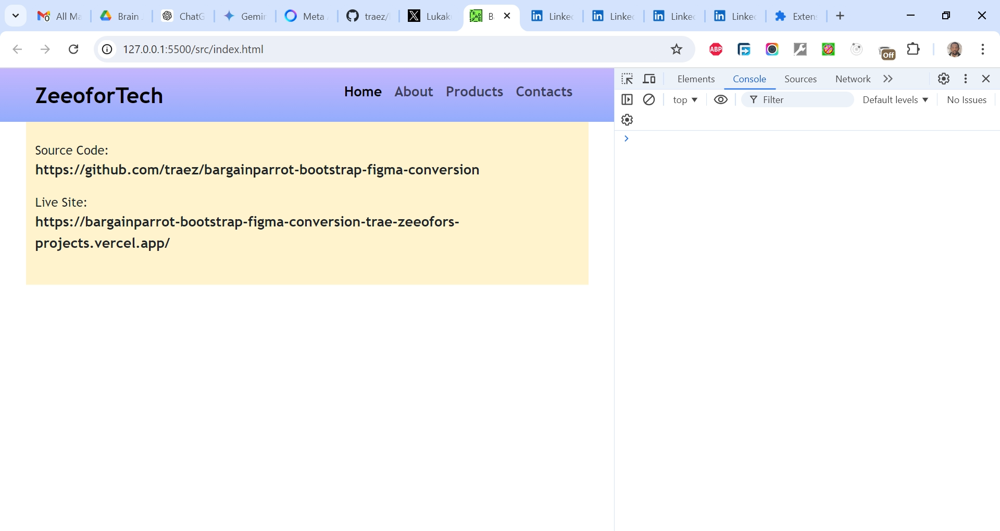

# Bargainparrot Bootstrap Figma Conversion

This is a Figma to HTML/Bootstrap conversion gig I got. Design is available [here](https://www.figma.com/design/dkfU8VWBkQhH3IzYy2PbMM/bargain-parrot). I believe "Practice makes Perfect", so keep building I must.

## Table of contents

- [Overview](#overview)
  - [The challenge](#the-challenge)
  - [Screenshot](#screenshot)
  - [Links](#links)
  - [My process](#my-process)
  - [Built with](#built-with)
  - [What I learned](#what-i-learned)
  - [Continued development](#continued-development)
  - [Useful resources](#useful-resources)
  - [Author](#author)
  - [Acknowledgments](#acknowledgments)

## Overview

### The Challenge/User Stories

- Translate Figma UI components to HTML and Bootstrap accurately.
- Ensure responsive design matches Figma specifications.
- Achieve pixel-perfect alignment across devices.
- Maintain consistent styling as per the design system.
- Integrate exported assets into the HTML and Bootstrap codebase efficiently.
- Implement specified interactions and animations.
- Ensure accessibility standards compliance.
- Test for cross-browser compatibility.
- Provide comprehensive documentation for handoff.

### Screenshot

### Links

- Solution URL: [https://github.com/traez/bargainparrot-bootstrap-figma-conversion](https://github.com/traez/bargainparrot-bootstrap-figma-conversion)
- Live Site URL: [https://bargainparrot-bootstrap-figma-conversion-trae-zeeofors-projects.vercel.app/](https://https://bargainparrot-bootstrap-figma-conversion-trae-zeeofors-projects.vercel.app/)

## My process

### Built with

- Semantic HTML5 markup
- CSS custom properties
- Flexbox and CSS Grid
- Mobile-first workflow
- [React](https://reactjs.org/) - JS library**  
- [Next.js](https://nextjs.org/) - React framework**  
- Tailwind CSS**
- Typescript**  
- Nodejs (with/without Expressjs)
- MongoDB** 
- Bootstrap

### What I learned

- **Emmet Abbreviations in VSCode:**  
Typing `!` and hitting `Tab` in VS Code magically expands to a full HTML5 boilerplate.    
- **Comment Out Text:**  
Single-line comments: Windows/Linux: `Ctrl + /`  
Multi-line comments: Windows/Linux: `Shift + Alt + A`  
- **Installed Extensions:**  
**Bootstrap IntelliSense**: Provides suggestions for Bootstrap classes.   
**Live Sass Compile**r: Converts Bootstrap's SCSS to CSS.  
- **Tailwind vs. Bootstrap:**  
My take: Tailwind is like LEGO blocks, flexible and customizable. Bootstrap is a framework with opinionated classes that often need overwriting. Tailwind's richer ecosystem and modern tools make it better for long-term maintainability.    
- **How to Install Bootstrap with NPM:**  
YouTube Tutorial: [https://www.youtube.com/watch?v=WPAiTlQr7no&t=139s](https://www.youtube.com/watch?v=WPAiTlQr7no&t=139s)  
GeeksforGeeks Guide: [https://www.geeksforgeeks.org/how-to-install-bootstrap-5](https://www.geeksforgeeks.org/how-to-install-bootstrap-5)
- **This Incomplete Tutorial:**  
The rest of the content involved the author selecting Bootstrap classes, me using a cheat sheet and official docs to understand class usage, and the author overwriting many of the classes.   
- **Cheat Sheet:**  
[FastBootstrap Cheat Sheet](https://fastbootstrap.com/docs): The best Bootstrap cheat sheet I could find with a detailed explanation of each class. Even the official docs aren't as explicitly and well arranged.   
- **Final Thoughts:**  
This episode enabled me to understand the framework, so it's all good. No knowledge/experience is a waste. Getting my first gig also thought me to move away from "burn-out" formal applications and instead towards the gig market. Rejig CV/Portfolio with gig experience and then apply formally as experienced Dev.  

### Continued development

- More projects; increased competence!

### Useful resources

Stackoverflow  
YouTube  
Google  
ChatGPT

## Author

- Website - [Trae Zeeofor](https://github.com/traez)
- Twitter - [@trae_z](https://twitter.com/trae_z)

## Acknowledgments

-Jehovah that keeps breath in my lungs
